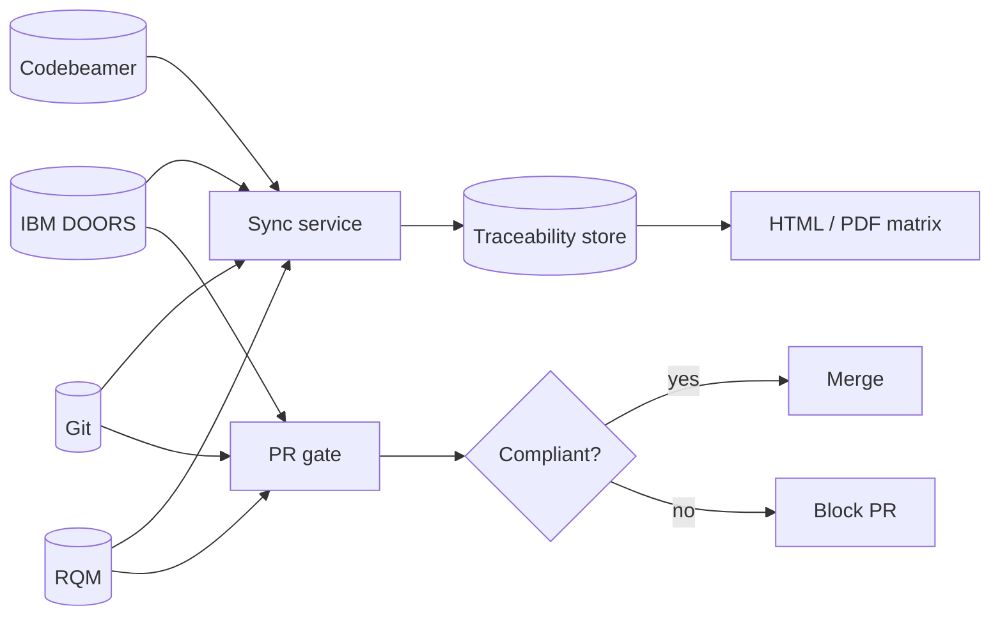

# Continuous Traceability Matrix Generator

**DOORS ↔ Git ↔ RQM ↔ Codebeamer**

Python/REST synchronization service for ASPICE Level 2/3 bidirectional traceability — from customer requirements through design items, source commits, and RQM test evidence — with audit-ready HTML/PDF matrices for nightly release builds.

---

## Why this exists

Manual ASPICE traceability spreadsheets before audits waste engineering time and drift from the systems of record. This service:

1. **Synchronizes** DOORS / Codebeamer / Git / RQM into one traceability graph  
2. **Gates pull requests** on compliant requirement tags (e.g. `REQ_ADAS_USS_042`) and linked unit/integration tests in RQM  
3. **Generates** an end-to-end ASPICE matrix artifact (HTML/PDF) during nightly builds  

## Architecture at a glance



Hexagonal layout (ports & adapters), sequence diagrams, and coverage flow: **[docs/architecture.md](docs/architecture.md)**.

---

## Documentation

| Guide | Description |
|---|---|
| [docs/README.md](docs/README.md) | Documentation index |
| [Overview](docs/overview.md) | Problem, personas, success metrics |
| [Getting started](docs/getting-started.md) | Install, configure, first sync |
| [Architecture](docs/architecture.md) | Diagrams, layers, sequences |
| [Data model](docs/data-model.md) | Domain entities and links |
| [Deployment](docs/deployment.md) | CI-only vs API service ops |
| [Configuration](docs/configuration.md) | YAML + environment variables |
| [CLI reference](docs/cli.md) | `sync`, `validate-pr`, `generate-matrix`, `serve` |
| [REST API](docs/api.md) | Endpoints, payloads, status codes |
| [Requirement tags](docs/requirement-tags.md) | Tag format and commit conventions |
| [Adapters](docs/adapters.md) | Mapping DOORS / CB / Git / RQM APIs |
| [CI/CD](docs/ci-cd.md) | PR gate + nightly matrix workflows |
| [Testing](docs/testing.md) | Unit, integration, coverage |
| [Troubleshooting](docs/troubleshooting.md) | Common failures and fixes |
| [Contributing](docs/contributing.md) | Local development standards |

### Package READMEs

| Package | README |
|---|---|
| Application root | [src/traceability/README.md](src/traceability/README.md) |
| Domain models | [src/traceability/domain/README.md](src/traceability/domain/README.md) |
| ALM adapters | [src/traceability/adapters/README.md](src/traceability/adapters/README.md) |
| Application services | [src/traceability/services/README.md](src/traceability/services/README.md) |
| REST API | [src/traceability/api/README.md](src/traceability/api/README.md) |
| Exporters | [src/traceability/exporters/README.md](src/traceability/exporters/README.md) |
| Tests | [tests/README.md](tests/README.md) |
| Config | [config/README.md](config/README.md) |
| Scripts | [scripts/README.md](scripts/README.md) |
| GitHub Actions | [.github/workflows/README.md](.github/workflows/README.md) |

---

## Quick start

```bash
# Requires Python 3.11+
python3 -m venv .venv
source .venv/bin/activate
pip install -e ".[dev]"

# Optional PDF export (WeasyPrint + system libs)
pip install -e ".[pdf]"

cp .env.example .env   # fill secrets
pytest
traceability serve --port 8080
```

Open interactive API docs at [http://127.0.0.1:8080/docs](http://127.0.0.1:8080/docs).

Full walkthrough: [docs/getting-started.md](docs/getting-started.md).

---

## Repository layout

```text
.
├── README.md                 # This file
├── docs/                     # Detailed documentation
├── config/default.yaml       # Default runtime configuration
├── src/traceability/         # Application package (hexagonal architecture)
├── tests/                    # Unit + integration tests
├── scripts/                  # Nightly / ops helpers
└── .github/workflows/        # CI, PR gate, nightly matrix
```

---

## Core workflows

### 1. Synchronize ALM data

```bash
traceability --config config/default.yaml sync --git-branch main
```

### 2. Validate a pull request

```bash
traceability validate-pr 42
# exit 0 = compliant, exit 2 = non-compliant
```

### 3. Generate the ASPICE matrix

```bash
traceability generate-matrix --build-id nightly-20260315 --html --pdf
# artifacts/traceability_matrix_*.html (.pdf)
# exit 3 if coverage gaps remain
```

Or via REST:

```bash
curl -s -X POST http://127.0.0.1:8080/api/v1/matrix/generate \
  -H 'Content-Type: application/json' \
  -d '{"build_id":"nightly-1","sync_first":true,"export_html":true,"export_pdf":false}'
```

---

## Requirement tag convention

```text
REQ_[A-Z0-9]+(?:_[A-Z0-9]+)*_\d{3,}
```

Examples: `REQ_ADAS_USS_042`, `REQ_BCM_PWR_001`

Preferred commit header:

```text
feat: implement USS ranging

Requires: REQ_ADAS_USS_042
```

Details: [docs/requirement-tags.md](docs/requirement-tags.md).

---

## Status

| Check | Command / location |
|---|---|
| Unit + integration tests | `pytest` |
| Lint | `ruff check src tests` |
| PR gate workflow | `.github/workflows/pr-traceability-gate.yml` |
| Nightly matrix workflow | `.github/workflows/nightly-matrix.yml` |

---

## License

MIT — see [LICENSE](LICENSE).
