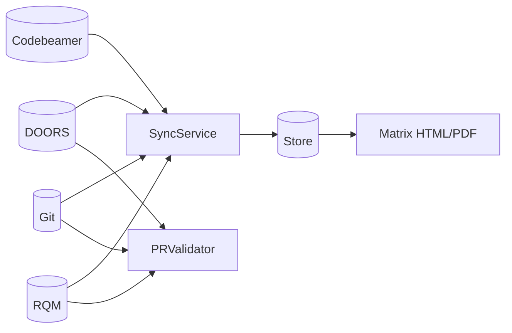

# Documentation index

Welcome to the Continuous Traceability Matrix Generator docs.

This project links **IBM DOORS**, **Codebeamer**, **Git**, and **IBM RQM** into a bidirectional ASPICE traceability graph and exports audit-ready matrices.

## Start here

1. [Product overview](overview.md) — problem, solution, personas  
2. [Getting started](getting-started.md) — install and first sync  
3. [Architecture](architecture.md) — diagrams, layers, sequences  

## Architecture & design

| Document | Contents |
|---|---|
| [Architecture](architecture.md) | Context, hexagonal view, sequences, coverage flow |
| [Data model](data-model.md) | Domain entities, links, invariants |
| [Adapters](adapters.md) | Vendor JSON façades and extension points |
| [Deployment](deployment.md) | CI-only vs API service, ops guidance |

## Operator guides

| Document | Audience | Contents |
|---|---|---|
| [Configuration](configuration.md) | Admins | YAML + env vars |
| [CLI reference](cli.md) | CI / release | Commands and exit codes |
| [REST API](api.md) | Integrators | Endpoints and payloads |
| [Requirement tags](requirement-tags.md) | Developers | Tag format and PR conventions |
| [CI/CD](ci-cd.md) | DevOps | GitHub Actions wiring |
| [Troubleshooting](troubleshooting.md) | Support | Common failures |

## Extender guides

| Document | Contents |
|---|---|
| [Testing](testing.md) | Unit / integration strategy |
| [Contributing](contributing.md) | Standards and PR checklist |

## Architecture at a glance

Full diagrams: [architecture.md](architecture.md).

## Package-level READMEs

| Package | README |
|---|---|
| Application | [`src/traceability/`](../src/traceability/README.md) |
| Domain | [`domain/`](../src/traceability/domain/README.md) |
| Adapters | [`adapters/`](../src/traceability/adapters/README.md) |
| Services | [`services/`](../src/traceability/services/README.md) |
| API | [`api/`](../src/traceability/api/README.md) |
| Exporters | [`exporters/`](../src/traceability/exporters/README.md) |
| Resilience | [`resilience/`](../src/traceability/resilience/README.md) |
| Tests | [`tests/`](../tests/README.md) |
| Config | [`config/`](../config/README.md) |
| Scripts | [`scripts/`](../scripts/README.md) |
| Workflows | [`.github/workflows/`](../.github/workflows/README.md) |

## Glossary

| Term | Meaning |
|---|---|
| **ASPICE** | Automotive SPICE — process model requiring bidirectional requirements traceability |
| **Requirement tag** | Stable ID such as `REQ_ADAS_USS_042` |
| **Trace row** | One requirement’s end-to-end coverage status |
| **Gap** | Missing design, commit, test case, or execution evidence |
| **Port** | Interface an adapter implements (Dependency Inversion) |
| **Adapter** | Concrete REST client for an ALM tool |
