# Architecture

Detailed design of the Continuous Traceability Matrix Generator
(**DOORS ↔ Git ↔ RQM ↔ Codebeamer**).

## Goals

| Goal | How the design supports it |
|---|---|
| ASPICE L2/3 bidirectional traceability | Join key = requirement tag across all four systems |
| Low coupling to vendor APIs | Hexagonal ports & adapters |
| Safe merge gates | Deterministic PR validator with explicit issue codes |
| Audit-ready evidence | Nightly HTML/PDF matrix with gap codes |
| Operational resilience | Retries, fail-soft sync, structured logs |

---

## System context

Where this service sits in the automotive toolchain:

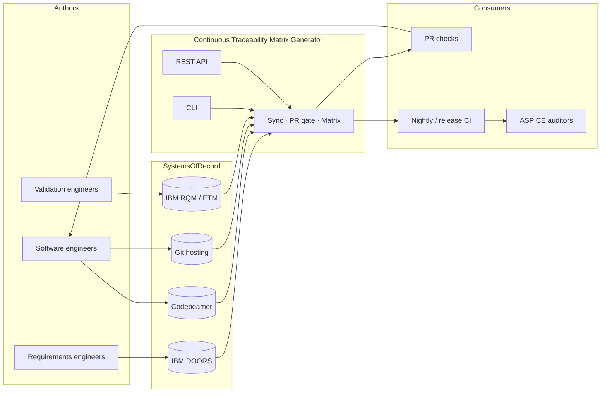

---

## Hexagonal (ports & adapters) view

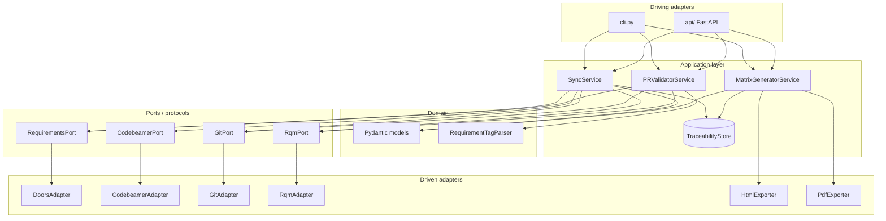

**Dependency rule:** outer layers may depend inward. Domain and services never import concrete HTTP clients.

---

## Component / package map

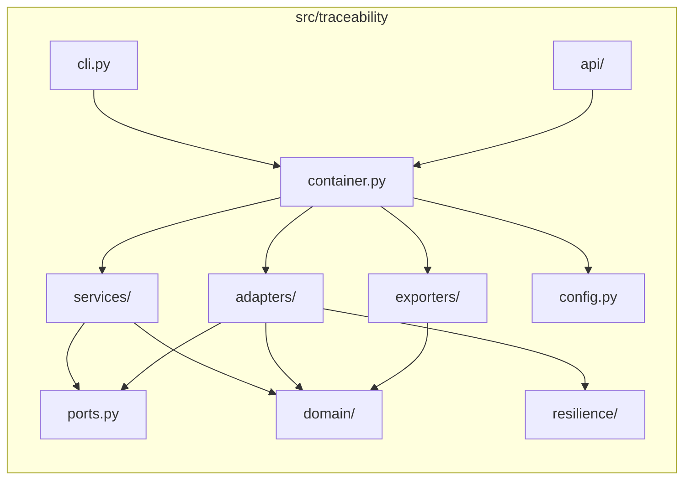

| Path | Responsibility |
|---|---|
| `domain/` | Immutable models, tag parsing — no I/O |
| `ports.py` | `Protocol` interfaces for ALM systems |
| `adapters/` | REST clients implementing ports |
| `services/` | Sync, PR validation, matrix generation |
| `exporters/` | HTML / PDF rendering |
| `resilience/` | Retry helpers (tenacity) |
| `api/` | FastAPI routes + schemas |
| `container.py` | Composition root (wiring) |
| `cli.py` | Click commands for CI |
| `config.py` | YAML + env settings |

---

## Domain model (traceability graph)

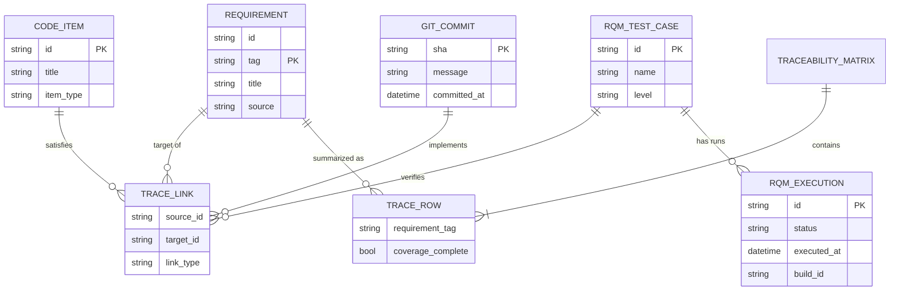

Join key across systems: **requirement tag** (e.g. `REQ_ADAS_USS_042`).

Link types:

| Type | Meaning |
|---|---|
| `satisfies` | Codebeamer item → requirement |
| `implements` | Git commit → requirement |
| `verifies` | RQM test case → requirement |
| `derives` | Child requirement → parent (reserved) |

---

## End-to-end data flow

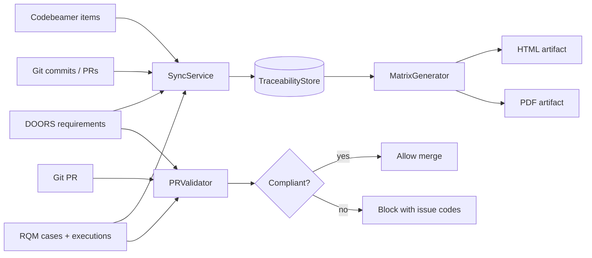

---

## Sequence: multi-ALM sync

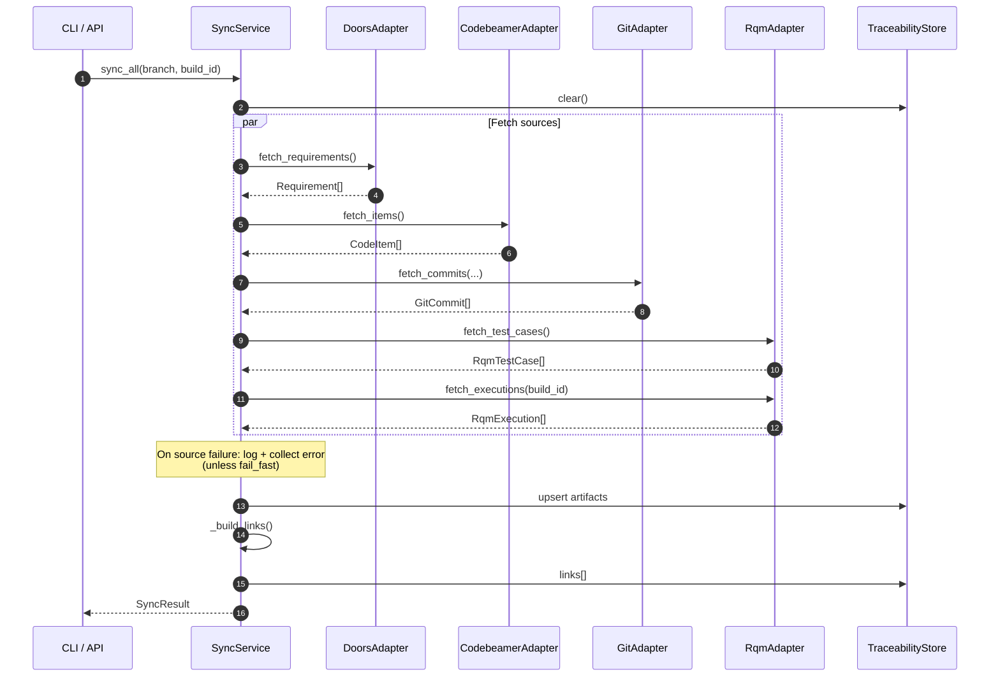

---

## Sequence: PR compliance gate

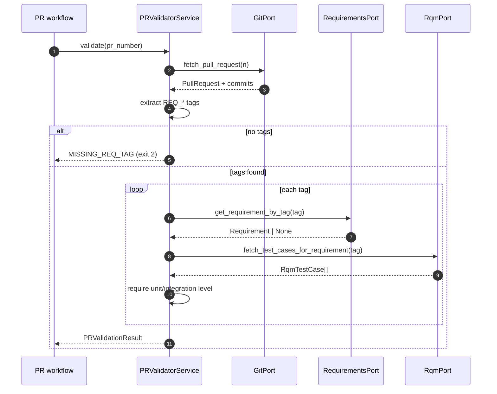

---

## Sequence: nightly matrix

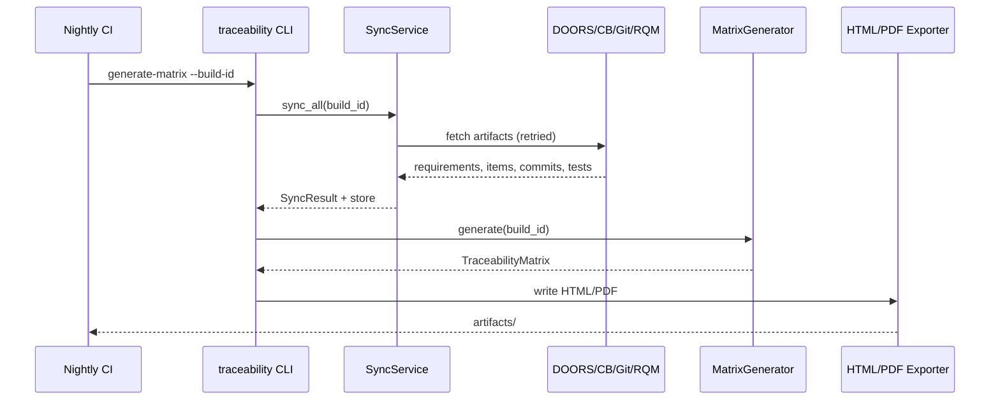

---

## Coverage completeness decision

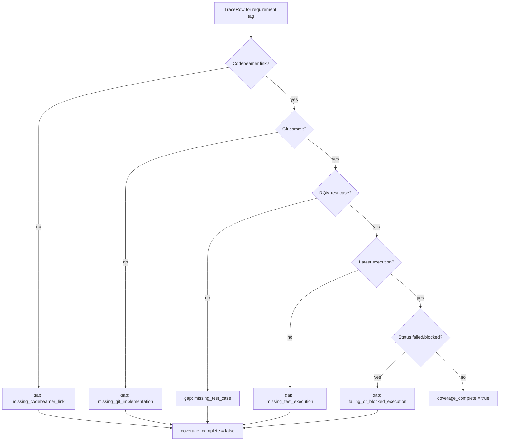

---

## Deployment / runtime topology

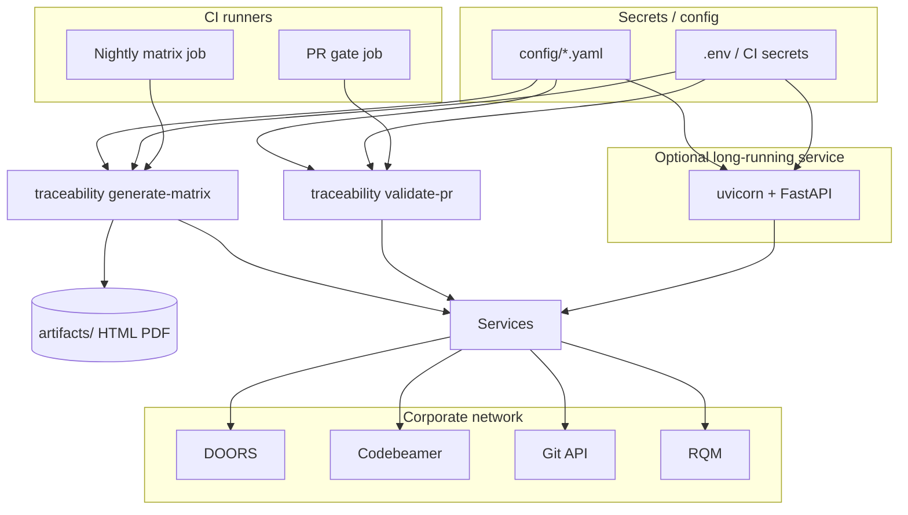

Typical modes:

1. **Ephemeral CI** — CLI only (recommended for PR gate + nightly)  
2. **Always-on API** — `traceability serve` behind an internal gateway  

---

## Resilience & error model

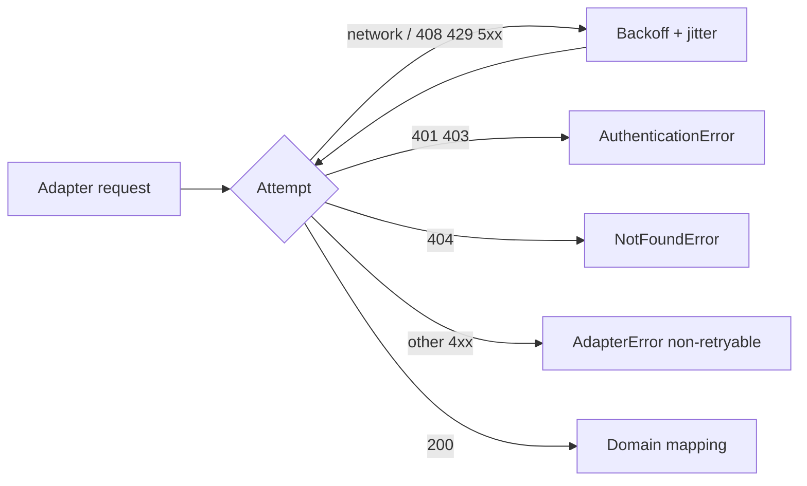

| Concern | Behavior |
|---|---|
| Retries | `resilience.with_retries` + tenacity |
| Sync failure mode | Fail-soft by default (`sync.fail_fast: false`) |
| Logging | JSON via structlog (`adapter_retry`, `sync_completed`, …) |
| Exceptions | Typed hierarchy in `exceptions.py` |

---

## Design principles (SOLID)

| Principle | Manifestation |
|---|---|
| **S**ingle Responsibility | One service per use-case |
| **O**pen/Closed | New Git provider → new adapter, same `GitPort` |
| **L**iskov | Fakes in tests substitute real adapters |
| **I**nterface Segregation | Narrow ports per system |
| **D**ependency Inversion | Services depend on protocols, not HTTP |

---

## Persistence note

`TraceabilityStore` is intentionally **in-memory**. For multi-instance production, introduce a repository (Postgres/SQLite) behind the same service APIs — exporters and PR validation stay unchanged.

---

## Related docs

- [Data model details](data-model.md)
- [Adapters / JSON façades](adapters.md)
- [Deployment & operations](deployment.md)
- [API](api.md) · [CLI](cli.md) · [CI/CD](ci-cd.md)
