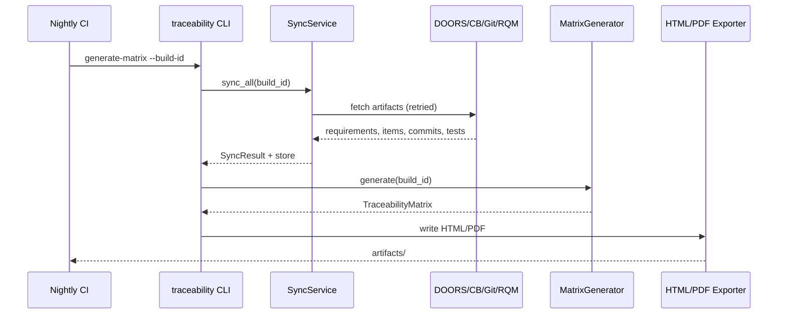

# Architecture

## Goals

- Bidirectional ASPICE traceability across four systems of record  
- Swappable ALM integrations without changing business rules  
- Deterministic PR gating and audit-friendly matrix export  
- Resilient I/O (retries, structured logs, fail-soft sync)  

## Style: hexagonal (ports & adapters)

```text
                    ┌─────────────────────────┐
                    │   CLI / FastAPI (api)    │
                    └────────────┬────────────┘
                                 │
                    ┌────────────▼────────────┐
                    │  Application services   │
                    │  sync · pr · matrix     │
                    └────────────┬────────────┘
                                 │ depends on
                    ┌────────────▼────────────┐
                    │   Ports (protocols)     │
                    └────────────┬────────────┘
               ┌─────────┬───────┼───────┬─────────┐
               ▼         ▼       ▼       ▼         ▼
            DOORS   Codebeamer  Git     RQM    (fakes)
            adapter  adapter  adapter adapter  in tests
```

**Dependency rule:** outer layers may depend inward; domain and services never import concrete HTTP clients.

## Package map

| Path | Responsibility |
|---|---|
| `domain/` | Immutable Pydantic models, tag parsing — no I/O |
| `ports.py` | `Protocol` interfaces for ALM systems |
| `adapters/` | REST clients implementing ports |
| `services/` | Use-cases: sync, PR validation, matrix build |
| `exporters/` | HTML/PDF rendering |
| `resilience/` | Retry helpers (tenacity) |
| `api/` | FastAPI routes + request/response schemas |
| `container.py` | Composition root (wiring) |
| `cli.py` | Click commands for CI |
| `config.py` | Settings loading |

## Runtime data flow

### Sync

1. `SyncService.sync_all` fetches requirements, code items, commits, test cases, executions  
2. Results land in an in-memory `TraceabilityStore`  
3. Directed `TraceLink` edges are built (`satisfies`, `implements`, `verifies`)  

### PR validation

1. Load PR + commits from Git port  
2. Extract tags from title, body, and `Requires:` / `REQ:` headers  
3. For each tag: ensure DOORS requirement exists and RQM unit/integration case exists  

### Matrix generation

1. Join store by requirement tag  
2. Emit `TraceRow` with coverage flags and gap codes  
3. Export via `HtmlExporter` / `PdfExporter`  

## Design principles

| Principle | How it shows up |
|---|---|
| **S**ingle Responsibility | One service per use-case |
| **O**pen/Closed | New Git provider → new adapter, same `GitPort` |
| **L**iskov | Fakes in tests substitute real adapters |
| **I**nterface Segregation | Narrow ports (`RequirementsPort`, `RqmPort`, …) |
| **D**ependency Inversion | Services depend on protocols, not HTTP |

## Error handling

- Typed hierarchy in `exceptions.py` (`AdapterError`, `NotFoundError`, …)  
- HTTP 4xx/5xx mapped; retryable set: `408, 425, 429, 500–504`  
- Sync aggregates per-source errors unless `fail_fast: true`  
- Structured JSON logs via structlog  

## Persistence note

`TraceabilityStore` is intentionally **in-memory**. For multi-instance production, replace it with a repository (Postgres/SQLite) behind the same service APIs — no change required to exporters or PR validation logic.

## Sequence (nightly matrix)


