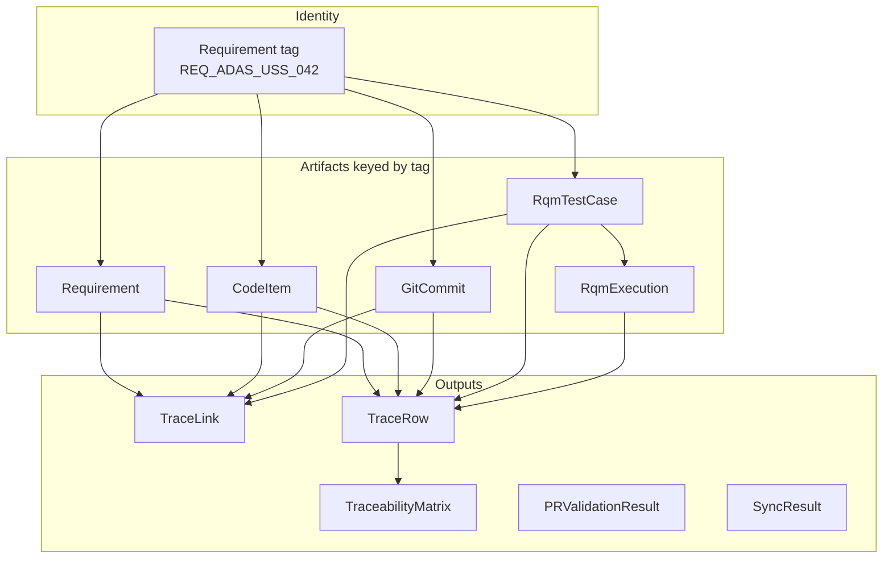

# Data model

Canonical domain types live in `src/traceability/domain/models.py`.
They are the only shapes services and exporters understand.

## Overview



## Entities

### `Requirement`

| Field | Type | Notes |
|---|---|---|
| `id` | str | Vendor ID (DOORS object id) |
| `tag` | str | Normalized join key |
| `title` | str | Human-readable name |
| `description` | str | Optional body |
| `source` | `ArtifactSource` | `doors` / `codebeamer` |
| `module` | str? | DOORS module path |
| `status` | str | e.g. Approved |
| `parent_id` | str? | Derivation support |
| `attributes` | dict | Opaque vendor attrs |
| `last_modified` | datetime? | ISO timestamps |

### `CodeItem`

Codebeamer design / work item that **satisfies** a requirement.

### `GitCommit` / `PullRequest`

Implementation evidence. Tags come from commit headers (`Requires:`) or PR title/body.

### `RqmTestCase` / `RqmExecution`

Verification evidence. PR gate requires `VerificationLevel.UNIT` or `INTEGRATION`.

### `TraceLink`

Directed edge in the graph:

```text
source_kind  --link_type-->  target_kind
codebeamer   satisfies       requirement
git_commit   implements      requirement
test_case    verifies        requirement
```

### `TraceRow` / `TraceabilityMatrix`

Audit projection. One row per requirement with:

- linked Codebeamer IDs  
- commit SHA prefixes  
- test case IDs  
- latest execution status  
- `coverage_complete` + `gaps[]`  

## Enumerations

| Enum | Values |
|---|---|
| `ArtifactSource` | doors, codebeamer, git, rqm |
| `LinkType` | satisfies, verifies, implements, derives |
| `VerificationLevel` | unit, integration, system, acceptance |
| `ExecutionStatus` | passed, failed, blocked, not_run, inconclusive |

## Invariants

1. Tags are uppercased at parse boundaries.  
2. Domain models prefer `frozen=True` (immutability).  
3. Gap analysis never mutates store contents.  
4. Vendor JSON field names must not leak into these models — map in adapters.

## Related

- [Requirement tags](requirement-tags.md)
- [Architecture](architecture.md)
- [Package README — domain](../src/traceability/domain/README.md)
