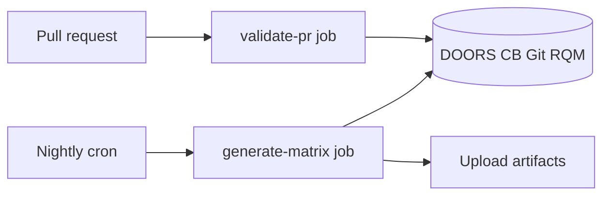
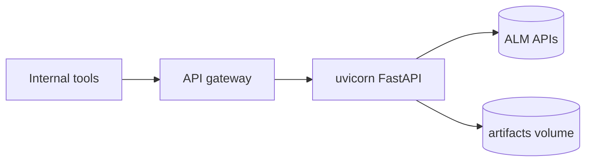

# Deployment & operations

## Recommended topologies

### A. CI-only (default)

No long-running process. GitHub Actions (or Jenkins) invokes the CLI.



**Pros:** simple, scales with runners, no hosting cost.  
**Cons:** no on-demand API for dashboards.

### B. Internal API service

```bash
traceability serve --host 0.0.0.0 --port 8080
```

Place behind VPN / API gateway / mTLS. Do not expose ALM credentials to browsers.



## Container sketch

Example Dockerfile (illustrative — not checked in as required runtime):

```dockerfile
FROM python:3.12-slim
WORKDIR /app
COPY pyproject.toml README.md ./
COPY src ./src
COPY config ./config
RUN pip install --no-cache-dir .
EXPOSE 8080
CMD ["traceability", "serve", "--host", "0.0.0.0", "--port", "8080"]
```

For PDF builds, start from an image that includes WeasyPrint system libraries, or export HTML only.

## Configuration in production

| Item | Guidance |
|---|---|
| Secrets | CI secrets / vault — never bake into images |
| Config | `config/prod.yaml` + `TRACEABILITY__*` overrides |
| Logs | Ship stdout JSON to your log stack |
| Timeouts | Raise `*_timeout_seconds` for slow ALMs |
| Retries | Tune `max_retries` per adapter |

See [configuration.md](configuration.md).

## Health & readiness

- Liveness: `GET /health`  
- Readiness (suggested): succeed a lightweight authenticated ping to each ALM, or expose a future `/ready` that checks last successful sync  

## Observability

Structured log events to watch:

| Event | Meaning |
|---|---|
| `api_started` | Service boot |
| `sync_source_failed` | One ALM failed during sync |
| `sync_completed` | Counts + error tally |
| `pr_validated` | Gate outcome |
| `matrix_generated` | Summary metrics |
| `adapter_retry` | Transient upstream issue |

## Backup / audit retention

Retain nightly HTML/PDF matrices per release for the duration required by your ASPICE evidence policy (often years). Store under versioned object storage if runners are ephemeral.

## Scaling notes

| Concern | Approach |
|---|---|
| Concurrent PR gates | Stateless CLI — parallelize freely |
| Large requirement sets | Increase HTTP timeouts; consider paging in adapters |
| Multi-instance API | Replace `TraceabilityStore` with shared DB |
| Rate limits | Rely on retry/backoff; add caching later if needed |

## Related

- [CI/CD](ci-cd.md)
- [Troubleshooting](troubleshooting.md)
- [Architecture — runtime topology](architecture.md#deployment--runtime-topology)
