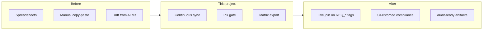

# Product overview

## Problem

ASPICE Level 2/3 assessments require **bidirectional traceability** from customer requirements (DOORS) through design (Codebeamer), implementation (Git), and verification (RQM). Teams often rebuild this in spreadsheets before every audit — slow, error-prone, and stale.

## Solution

A Python service that:

1. **Synchronizes** the four systems of record into one in-memory (or future DB-backed) graph  
2. **Gates pull requests** so merges without requirement tags / tests fail CI  
3. **Exports** an ASPICE matrix (HTML/PDF) on every nightly/release build  

## Personas

| Persona | Primary workflow |
|---|---|
| Software engineer | Puts `Requires: REQ_…` on commits; fixes PR gate failures |
| Validation engineer | Maintains RQM cases linked to the same tags |
| Release / quality engineer | Reviews nightly matrix gaps before freeze |
| ASPICE assessor | Consumes HTML/PDF evidence packs |

## Success metrics

| Metric | Source |
|---|---|
| `% requirements with complete coverage` | Matrix `summary.rows_complete` |
| PR gate block rate | CI logs / `PRValidationResult` |
| Time to produce audit matrix | Nightly job duration (target: minutes, not days) |
| Orphan tests / requirements | Matrix orphan lists |

## Non-goals (current scope)

- Full OSLC server implementation  
- Replacing DOORS / Codebeamer / RQM UIs  
- MISRA / Polyspace triage (separate automation)  
- Multi-tenant SaaS auth  

## Doc map

| If you want to… | Read |
|---|---|
| Install and run | [getting-started.md](getting-started.md) |
| Understand design | [architecture.md](architecture.md) |
| Wire real ALMs | [adapters.md](adapters.md) · [configuration.md](configuration.md) |
| Automate CI | [ci-cd.md](ci-cd.md) · [deployment.md](deployment.md) |
