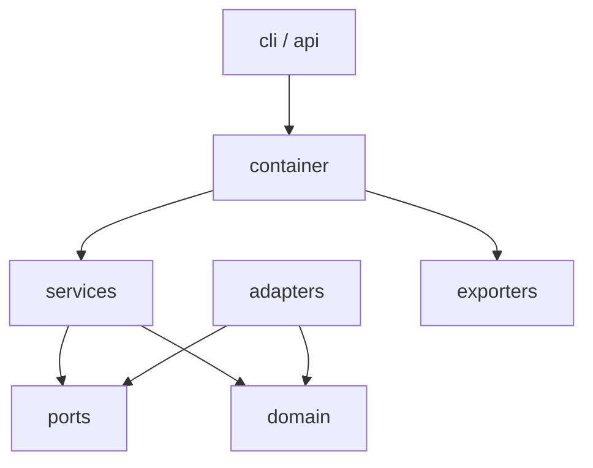

# `traceability` package

Application root for the ASPICE Continuous Traceability Matrix Generator.

## Entry points

| Entry | Module | Purpose |
|---|---|---|
| CLI | `traceability.cli:main` | `sync`, `validate-pr`, `generate-matrix`, `serve` |
| API app | `traceability.api.app:app` | FastAPI ASGI application |
| Composition | `traceability.container.build_container` | Wire settings → adapters → services |

## Layout

```text
traceability/
├── domain/        # Models + tag rules
├── adapters/      # DOORS, Codebeamer, Git, RQM
├── services/      # Sync, PR gate, matrix
├── exporters/     # HTML / PDF
├── api/           # REST surface
├── resilience/    # Retries
├── config.py      # Settings
├── container.py   # DI / composition root
├── ports.py       # Protocols
├── exceptions.py  # Error taxonomy
├── logging_setup.py
└── cli.py
```

## Layering



## Design rule

Depend **inward**: `api` / `cli` → `services` → `ports` ← `adapters`.  
Never import adapters from `domain`.

## Subpackage READMEs

- [domain/](domain/README.md)
- [adapters/](adapters/README.md)
- [services/](services/README.md)
- [api/](api/README.md)
- [exporters/](exporters/README.md)
- [resilience/](resilience/README.md)

## Docs

- [Architecture](../../docs/architecture.md)
- [Data model](../../docs/data-model.md)
- [Getting started](../../docs/getting-started.md)
- [API](../../docs/api.md)
- [CLI](../../docs/cli.md)
