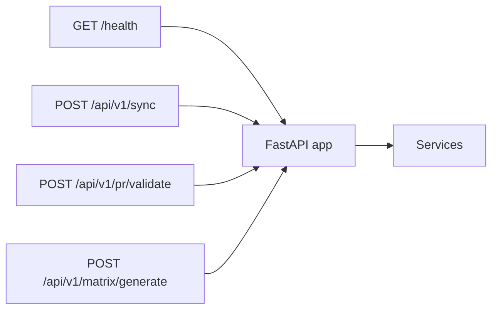

# API package

FastAPI surface for the synchronization service.

| Module | Contents |
|---|---|
| `app.py` | `create_app()`, route handlers, lifespan wiring |
| `schemas.py` | Request/response Pydantic models |

## Endpoints



- `GET /health`
- `POST /api/v1/sync`
- `POST /api/v1/pr/validate`
- `POST /api/v1/matrix/generate`

## Run

```bash
traceability serve --port 8080
# or
uvicorn traceability.api.app:app --reload --port 8080
```

Swagger UI: `http://127.0.0.1:8080/docs`

## Testing

`tests/integration/test_api_and_workflow.py` builds an `AppContainer` with fake ports and uses FastAPI `TestClient`.

## Full reference

[docs/api.md](../../../docs/api.md)
