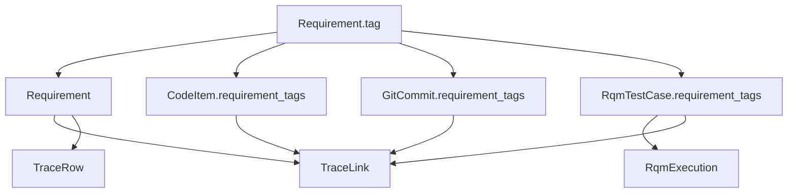

# Domain package

Pure, I/O-free models and requirement-tag rules. This layer has **no** HTTP, filesystem, or framework dependencies beyond Pydantic.

## Key types

| Type | Role |
|---|---|
| `Requirement` | DOORS/Codebeamer requirement |
| `CodeItem` | Codebeamer design/work item |
| `GitCommit` / `PullRequest` | Git evidence |
| `RqmTestCase` / `RqmExecution` | Test definition + run result |
| `TraceLink` / `TraceRow` / `TraceabilityMatrix` | Graph + matrix artifact |
| `PRValidationResult` / `SyncResult` | Use-case outcomes |
| `RequirementTagParser` | Extract/validate `REQ_*` tags |

Enums use `StrEnum`: `ArtifactSource`, `LinkType`, `VerificationLevel`, `ExecutionStatus`.

## Relationships

## Rules

- Prefer `frozen=True` models  
- Normalize tags to uppercase at the boundary  
- Do not name domain classes `Test*` (pytest collects them)  

## Related docs

- [Data model](../../../docs/data-model.md)
- [Requirement tags](../../../docs/requirement-tags.md)
- [Architecture](../../../docs/architecture.md)
