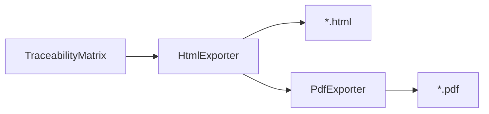

# Exporters package

Renders a `TraceabilityMatrix` to audit artifacts.

| Module | Class | Output |
|---|---|---|
| `html_exporter.py` | `HtmlExporter` | HTML via Jinja2 |
| `pdf_exporter.py` | `PdfExporter` | PDF via WeasyPrint (optional extra) |
| `templates/matrix.html.j2` | — | Default print-friendly layout |

## Pipeline



## Usage

```python
from traceability.exporters import HtmlExporter, PdfExporter

HtmlExporter().write(matrix, "artifacts/matrix.html")
PdfExporter().write(matrix, "artifacts/matrix.pdf")  # needs pip install -e ".[pdf]"
```

## Customizing the look

1. Copy `templates/matrix.html.j2`  
2. Point `matrix.html_template` / `HtmlExporter(template_dir=...)` at your template  
3. Keep the `matrix` context variable (rows, summary, orphans)  

## Related docs

- [CLI `generate-matrix`](../../../docs/cli.md)
- [Deployment](../../../docs/deployment.md)
- [Troubleshooting PDF](../../../docs/troubleshooting.md)
