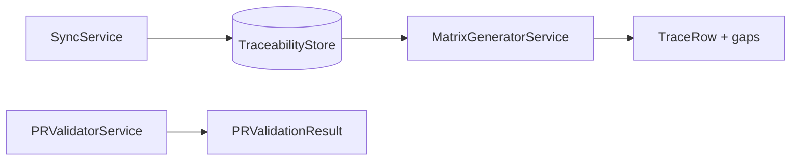

# Services package

Application use-cases. Each service depends on **ports**, never on concrete adapters.

| Module | Class | Use-case |
|---|---|---|
| `sync_service.py` | `SyncService`, `TraceabilityStore` | Pull ALM data + build links |
| `pr_validator.py` | `PRValidatorService` | PR tag + RQM coverage gate |
| `matrix_generator.py` | `MatrixGeneratorService` | ASPICE matrix + gap analysis |

## Flow

## `TraceabilityStore`

In-memory aggregate used after sync. Replace with a persistent repository for multi-instance deployments without changing exporters.

## Gap codes (matrix)

| Code | Meaning |
|---|---|
| `missing_codebeamer_link` | No design/work item |
| `missing_git_implementation` | No tagged commit |
| `missing_test_case` | No RQM case |
| `missing_test_execution` | Case exists, no run for build |
| `failing_or_blocked_execution` | Latest run not green |

## Related docs

- [Architecture sequences](../../../docs/architecture.md)
- [CLI](../../../docs/cli.md)
- [Requirement tags](../../../docs/requirement-tags.md)
