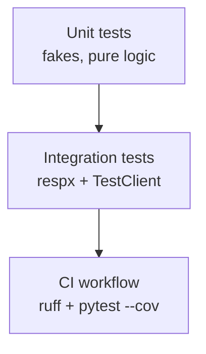

# Tests

Automated verification for the traceability platform.

## Structure

```text
tests/
├── README.md
├── conftest.py       # Fixtures: sample requirements, commits, PRs, executions
├── fakes.py          # FakeDoors, FakeCodebeamer, FakeGit, FakeRqm
├── unit/             # Fast isolated tests
└── integration/      # respx HTTP + FastAPI workflow tests
```

## Test pyramid



## Run

```bash
pytest
pytest -m unit
pytest -m integration
pytest --cov=traceability --cov-report=term-missing
```

## Fixtures (high level)

| Fixture | Provides |
|---|---|
| `sample_requirements` | USS + CAM DOORS requirements |
| `sample_code_items` | Codebeamer design for USS |
| `sample_commits` | Commit with `Requires: REQ_ADAS_USS_042` |
| `sample_test_cases` | Unit case + orphan system case |
| `sample_executions` | Passed execution for `nightly-42` |
| `sample_pr` | PR #42 bundling the sample commit |
| `tag_parser` | Default `RequirementTagParser` |

## Fakes

`tests/fakes.py` implements the same async methods as production ports so services can be tested without network I/O. `FailingDoors` simulates an unavailable ALM for fail-soft sync tests.

## Subfolder READMEs

- [unit/](unit/README.md)
- [integration/](integration/README.md)

## Docs

[docs/testing.md](../docs/testing.md)
